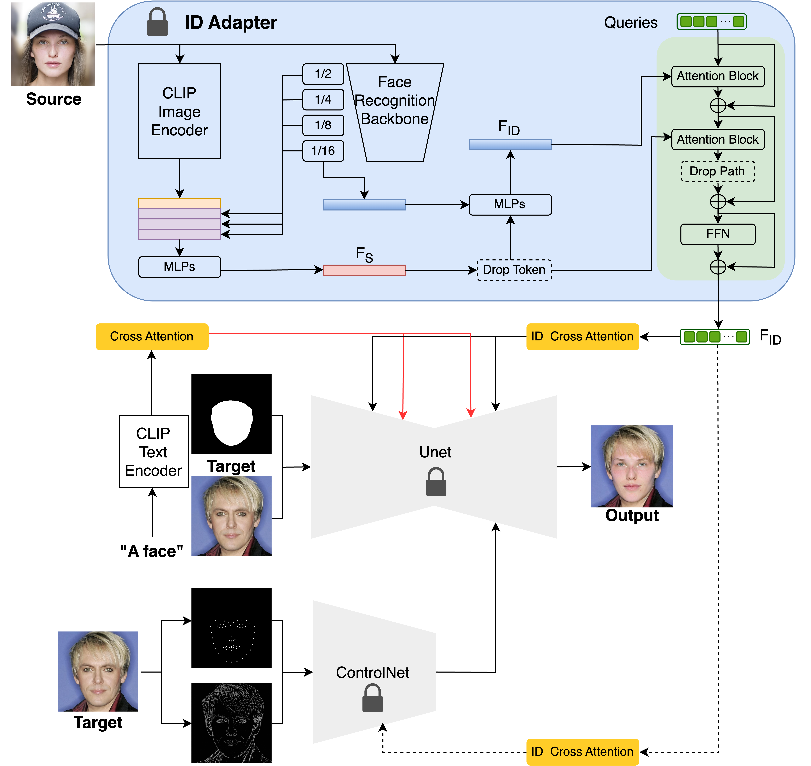

This repository is the draft code for the project: Free-finetuning face-swapping framework.

## Introduction <a name="introduction"></a>


<p align="center"> <br>  <br> </p>

## Requirements
```python
pip install -r requirements.txt
```

## Download
```python
git clone https://huggingface.co/Junjie96/UniPortrait models
git clone https://github.com/italojs/facial-landmarks-recognition/blob/master/shape_predictor_68_face_landmarks.dat models
```
```python
from huggingface_hub import hf_hub_download

#IP-Adapter
hf_hub_download(repo_id="h94/IP-Adapter", filename="models/image_encoder/config.json", local_dir="./models/IP-Adapter")
hf_hub_download(repo_id="h94/IP-Adapter", filename="models/image_encoder/model.safetensors", local_dir="./models/IP-Adapter")
hf_hub_download(repo_id="h94/IP-Adapter", filename="models/image_encoder/pytorch_model.bin", local_dir="./models/IP-Adapter")
hf_hub_download(repo_id="h94/IP-Adapter", filename="models/ip-adapter_sd15.bin", local_dir="./models/IP-Adapter")

#ControlNet kps
hf_hub_download(repo_id="georgefen/Face-Landmark-ControlNet", filename="models_for_diffusers/config.json", local_dir="./models/ControlNetModel_kps")
hf_hub_download(repo_id="georgefen/Face-Landmark-ControlNet", filename="models_for_diffusers/diffusion_pytorch_model.bin", local_dir="./models/ControlNetModel_kps")
```
## Inference
```python
python main.py --FFHQ #use --celebA for CelebMaskA dataset
```
## **Acknowledgements**

This code is built on some excellent repos, including [diffusers](https://github.com/huggingface/diffusers), [IP-Adapter](https://github.com/tencent-ailab/IP-Adapter) and [StyleAligned](https://github.com/google/style-aligned), [UniPortrait](https://github.com/junjiehe96/UniPortrait)
